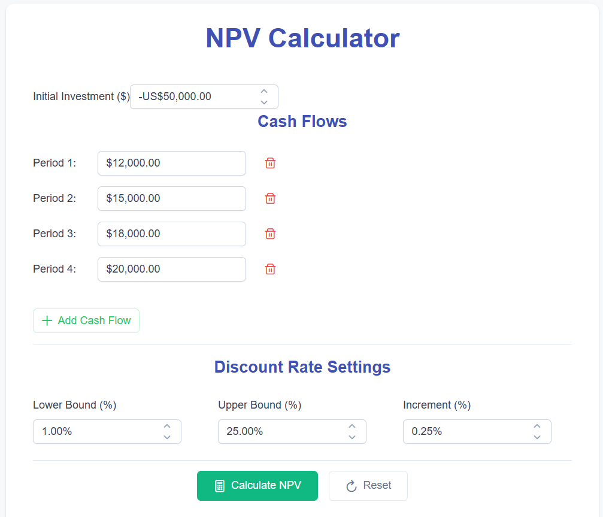
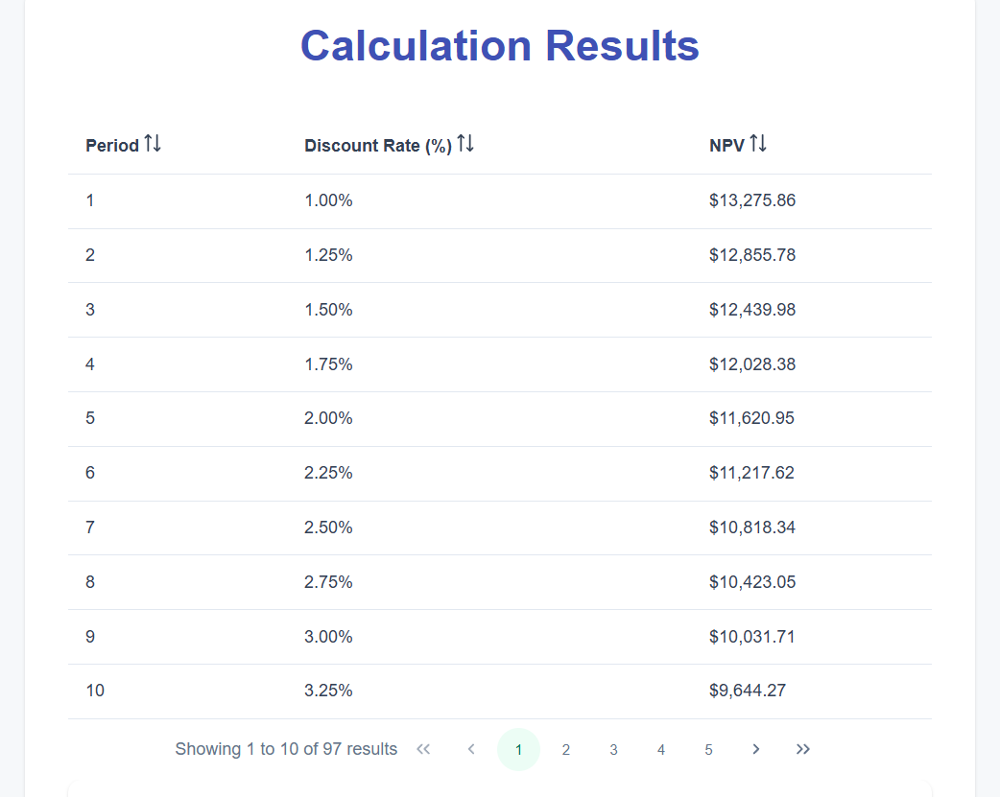

# NPV Calculator Solution

A modern, full-stack Net Present Value (NPV) calculator web application built with Angular (PrimeNG) and .NET 8 WebAPI.


---

## 🚀 Future Enhancements

### 🔧 Technical Improvements
- **Memory Cache Service:** Replace singleton calculator service with proper caching layer for better performance and scalability
- **Enhanced Client Validation:** Implement comprehensive form validation with real-time feedback and custom validators
- **Expanded Test Coverage:** Add more comprehensive unit tests, integration tests, and e2e testing for frontend components
- **Authentication & Authorization:** JWT-based authentication with role-based access control
- **Container Orchestration:** Complete Docker Compose setup with multi-container deployment

### 🌟 Feature Enhancements
- **Calculation History:** Persist and retrieve previous NPV calculations
- **Advanced Analytics:** Monte Carlo simulations and sensitivity analysis
- **Export Templates:** Customizable Excel/PDF report templates
- **Real-time Collaboration:** Multiple users working on shared calculations
- **API Rate Limiting:** Implement throttling and request limiting
- **Data Persistence:** Database integration for storing calculation results

### 📊 Performance Optimizations
- **Background Processing:** Queue-based calculation processing for large datasets
- **Caching Strategies:** Redis integration for distributed caching
- **Progressive Loading:** Lazy loading for large result sets
- **WebSocket Integration:** Real-time progress updates without polling

---

## ✨ Features

- **📊 NPV Calculator:** Enter initial investment and future cash flows, calculate NPV across a range of discount rates using standard financial convention
- **📈 Interactive Chart:** Visualize NPV vs. discount rate with break-even (IRR) analysis
- **🎯 Investment Insights:** Automated investment recommendation, break-even rate, and summary statistics
- **📤 Export & Actions:** Export results to Excel/PDF, start new calculations
- **🎨 Modern UI:** Responsive, professional design using PrimeNG components
- **🔌 RESTful API:** Clean endpoints with Swagger/OpenAPI documentation
- **🔒 Secure:** CORS configuration and input validation
- **🧪 Well Tested:** Comprehensive unit tests for both frontend and backend
- **📱 Responsive:** Works seamlessly on desktop, tablet, and mobile devices

---

## 🏗️ Architecture & Design Principles

This solution demonstrates:

- **API-First Design:** Backend serves as source of truth
- **Separation of Concerns:** Clear boundaries between presentation, business logic, and data layers
- **SOLID Principles:** Single responsibility, dependency injection, and interface segregation
- **Modular Architecture:** Loosely coupled services avoiding monolithic structures
- **Asynchronous Programming:** Non-blocking operations with progress tracking
- **Clean Code:** TypeScript/C# best practices with comprehensive testing

---

## 📁 Project Structure

```
NPVCalculator/
├── backend/NPVCalculator/
│   └── src/
│       ├── Npv.WebApi/         # .NET 8 WebAPI (controllers, CORS, Swagger, Docker)
│       ├── Npv.Services/       # Business logic (NPV calculation service)
│       ├── Npv.Core/           # Interfaces and domain abstractions
│       ├── Npv.Contracts/      # DTOs/models (requests, responses, results)
│       └── Npv.Tests.Unit/     # xUnit unit tests with high coverage
└── frontend/npv-calculator/
    └── src/
        └── app/
            ├── features/       # Angular features (calculator, chart, results)
            ├── core/models/    # TypeScript domain models
            ├── services/       # HTTP API service layer
            └── nav-menu/       # Navigation component
```

---

## 🚀 Getting Started

### Prerequisites
- **Node.js** 18+ and npm
- **.NET 8 SDK**
- Modern web browser

### 🔧 Backend Setup (.NET 8 WebAPI)
```bash
cd backend/NPVCalculator/src/Npv.WebApi
dotnet restore
dotnet build
dotnet run
```
- API runs at `https://localhost:44355`
- Swagger UI: [https://localhost:44355/swagger](https://localhost:44355/swagger)

### 🎨 Frontend Setup (Angular)
```bash
cd frontend/npv-calculator
npm install
npm start
```
- App runs at [http://localhost:4200](http://localhost:4200)
- API URL configured in `src/environments/environment.ts`

### 🔐 CORS Configuration
- Development: Allows `http://localhost:4200` and `https://localhost:4200`
- Production: Update CORS settings in `Program.cs` as needed

---

## 🌐 API Endpoints

| Method | Endpoint | Description |
|--------|----------|-------------|
| `POST` | `/api/npv/calculate` | Start a new NPV calculation |
| `GET` | `/api/npv/results/{calculationId}` | Retrieve calculation results |
| `GET` | `/api/npv/status/{calculationId}` | Check calculation progress |

📖 **Full API Documentation:** [Swagger UI](https://localhost:44355/swagger)  
🧪 **API Testing:** Use the included `.http` file in `Npv.WebApi` (VS Code/JetBrains REST Client)

---

## 🧪 Development & Testing

### Backend Testing
```bash
cd backend/NPVCalculator/src/Npv.Tests.Unit
dotnet test --verbosity normal
```

### Frontend Testing
```bash
cd frontend/npv-calculator
npm test
npm run test:coverage  # Generate coverage report
```

### Key Components
- **Business Logic:** `Npv.Services/NpvCalculatorService.cs`
- **API Controller:** `Npv.WebApi/Controllers/NpvController.cs`
- **Frontend Calculator:** `src/app/features/npv-calculator/`
- **Chart Visualization:** `src/app/features/npv-chart/`

---

## 🐳 Docker Support

```bash
cd backend/NPVCalculator/src/Npv.WebApi
docker build -t npv-webapi .
docker run -p 44355:443 --rm npv-webapi
```

---

## ⚙️ Configuration & Customization

### Environment Settings
- **API URL:** `frontend/npv-calculator/src/environments/environment.ts`
- **CORS Origins:** `backend/NPVCalculator/src/Npv.WebApi/Program.cs`
- **Styling:** `frontend/npv-calculator/src/styles.scss` or PrimeNG themes

### NPV Calculation Logic
Manual implementation following standard financial convention:
```
NPV = CF₀/(1+r)⁰ + Σ(CFt / (1 + r)^t) where t = 1 to n
```
- **Period 0 (CF₀)**: Initial investment (typically negative, no discounting)
- **Period 1+ (CFt)**: Future cash flows (properly discounted)

---

## 🎯 Core Requirements Fulfilled

✅ **API-First Design:** Clear separation between frontend and backend  
✅ **RESTful Architecture:** Clean, documented endpoints  
✅ **SOLID Principles:** Modular, testable, maintainable code  
✅ **Asynchronous Programming:** Non-blocking operations with progress tracking  
✅ **Unit Testing:** Comprehensive test coverage for business logic  
✅ **SPA Framework:** Modern Angular application with responsive design  
✅ **Data Visualization:** Interactive charts with Chart.js/PrimeNG  
✅ **Manual NPV Logic:** Custom implementation without financial libraries  

---

## 🌟 Additional Features

- **📊 Real-time Progress:** Live calculation progress with status updates
- **📈 Investment Analysis:** IRR (Internal Rate of Return) calculation with linear interpolation, automated investment recommendations, and comprehensive financial insights
- **📤 Export Options:** Excel and PDF export functionality
- **🎨 Professional UI:** Modern card-based design with PrimeNG components
- **📱 Responsive Design:** Mobile-first approach with flexible layouts
- **🔄 Form Validation:** Comprehensive input validation and error handling

---

## 📜 License

MIT License - feel free to use this project as a reference or starting point.

---

## 🛠️ Built With

- **Frontend:** [Angular](https://angular.io/) • [PrimeNG](https://primeng.org/) • [Chart.js](https://www.chartjs.org/) • [TypeScript](https://www.typescriptlang.org/)
- **Backend:** [.NET 8](https://dotnet.microsoft.com/) • [ASP.NET Core](https://docs.microsoft.com/en-us/aspnet/core/) • [Swagger/OpenAPI](https://swagger.io/)
- **Testing:** [Jasmine](https://jasmine.github.io/) • [xUnit](https://xunit.net/)
- **Tools:** [Docker](https://www.docker.com/) • [npm](https://www.npmjs.com/) • [Git](https://git-scm.com/)

---

## 📸 Screenshots





---

*This project was developed as a coding assessment to demonstrate full-stack development skills, architectural design, and best practices in modern web development.*
